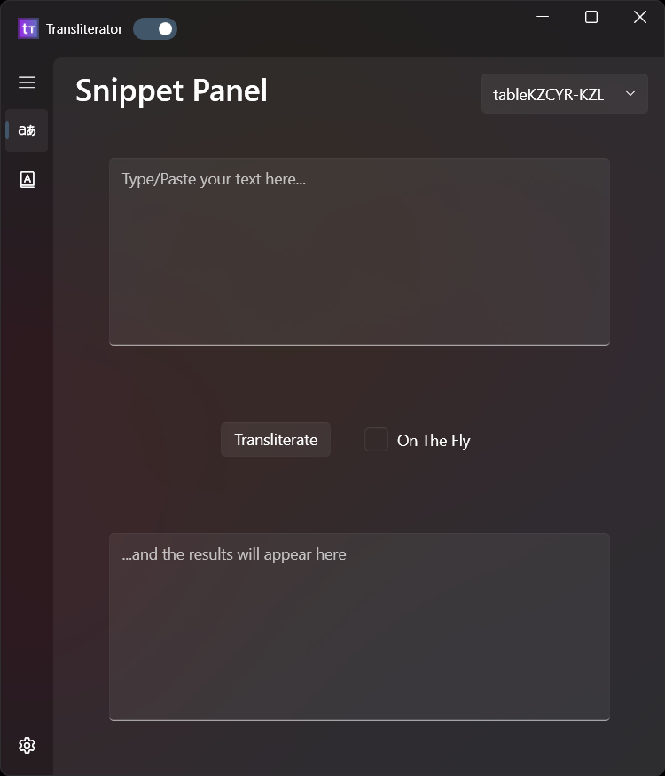
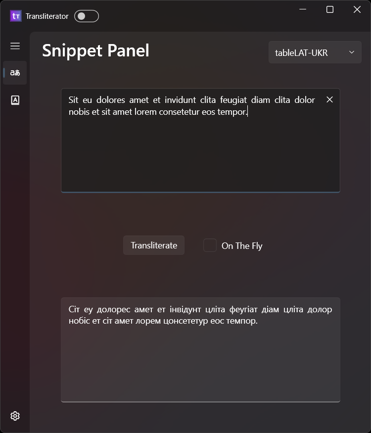
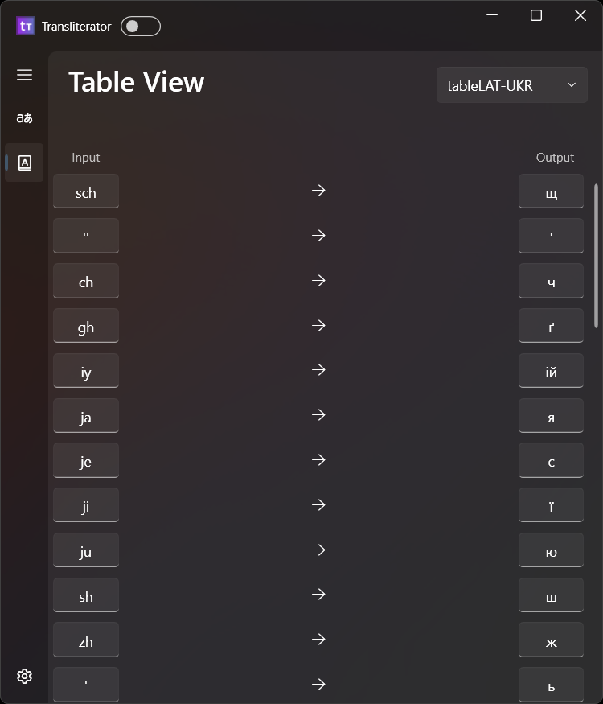
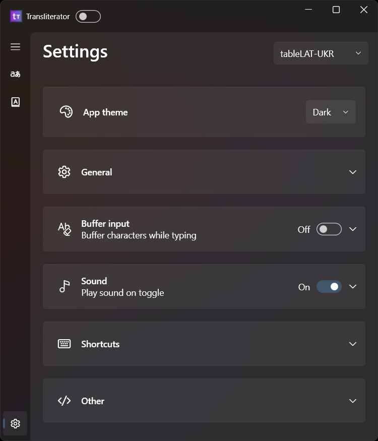
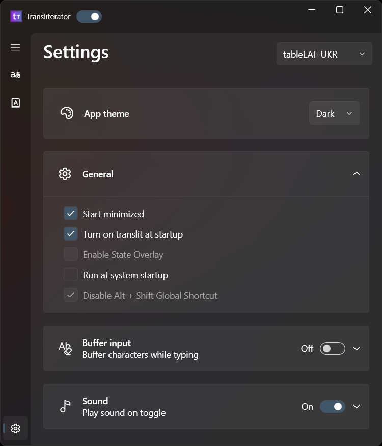
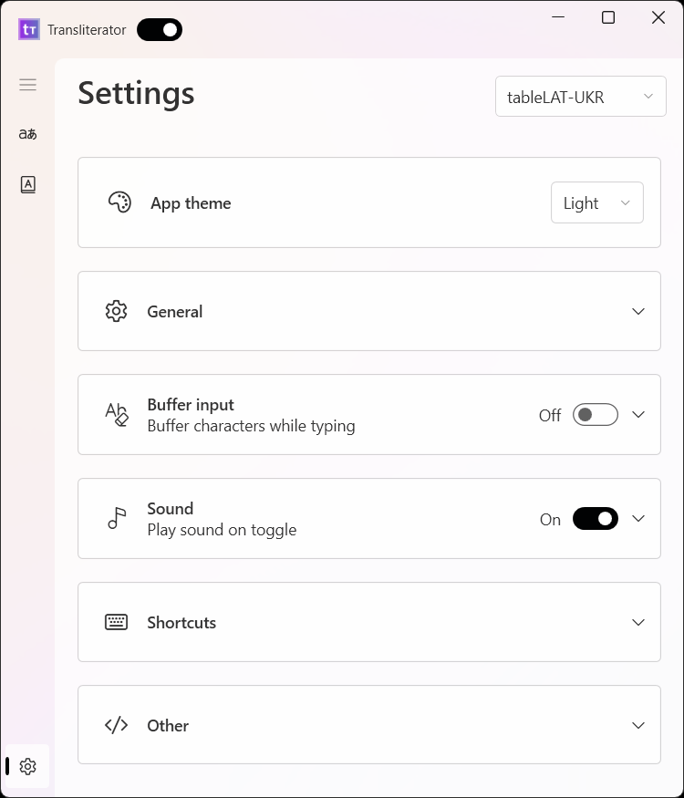
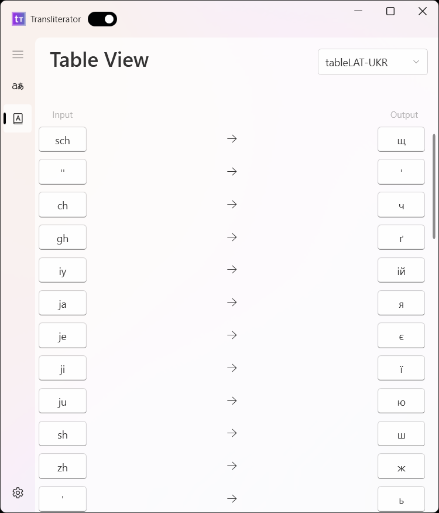
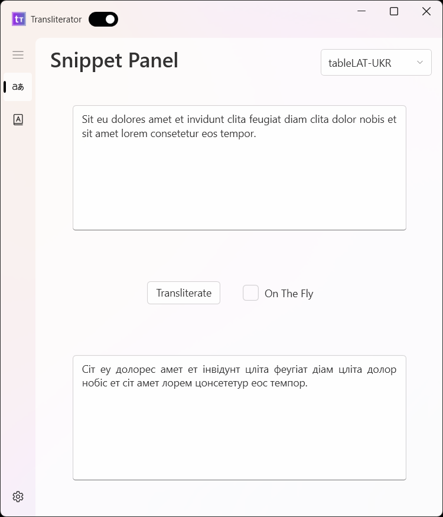

**English** | [Українською](readme-ukr.md)

<h1> Transliterator </h1>

> 🟢 **Project status**: active[[?]](https://github.com/Tyrrrz/.github/blob/master/docs/project-status.md)

Transliteration refers to the method of mapping from one system of writing to another based on phonetic similarity. 
With this tool, you type in letters (e.g. a, b, c etc.), which are converted to characters that have similar pronunciation in the target language.
For example, in Ukrainian transliteration, you can type in `vitannja` to get `вітання`.

 

This transliterator is an utility that converts user input by providing **system-wide** transliteration using a mapping between, for example, Latin and Cyrillic letters. The program supports different mappings for various languages and has multiple use cases beyond the initial purpose of facilitating typing in foreign languages.

## Use Cases

* Transliterating a snippet of text.
* Typing in foreign language via transliteration.
* [Some languages have two alphabets](https://www.google.com/url?q=https%3A%2F%2Fen.wikipedia.org%2Fwiki%2FDigraphia&sa=D). This tool should help, I think?
* Typing diacritics and accents. For example, to get `õ`, you can type `~o` and it will be converted to `õ`.

## Screenshots (Windows 11)

  
Screenshots

  
  
  
  
  
  
  
  

## Getting Started
1. Clone the repo or download installer from [release page](https://github.com/Seagullie/Transliterator/releases).
2. If you cloned the repo, compile and run the project.
3. Once the program boots up, select your language pair by clicking the dropdown in the top right corner and then selecting the table you want (for example, `tableAccentsAndDiacritics` or `tableENG-LAT_UKR-CYR`).
4. Type wherever you want: whether it be the snippet panel or notepad or your browser. Wow! ✨

## Transliteration Tables
Transliteration tables are stored in `Transliterator.Core\Resources\TranslitTables` as `.json` files. 
Each table is a mapping between input and output characters.
Some mappings do not follow existing transliteration standarts completely. That's due to technical limitations and for ease of use.

### Tables 
| Input                       | Output                   | Tested | Example   | File                          |
| --------------------------- | ------------------------ | ------ | --------- | ----------------------------- |
| Latin                       | Ukrainian Cyrilllic      | ✔️     | vitannja --> вітання | tableENG-LAT_UKR-CYR.json     |
| Latin                       | Bulgarian Cyrilllic      | -      | -         | tableENG-LAT_BUL-CYR.json     |
| Latin                       | Kazakh Cyrilllic (2021)  | -      | -         | tableENG-LAT_KZ-CYR_2021.json |
| Kazakh Cyrilllic            | Latin (Kazakhstan)       | -      | -         | tableKZ-CYR_KZ-LAT_2021.json  |
| Kazakh Latin                | Kazakh Cyrilllic (2021)  | -      | -         | tableKZ-LAT_KZ-CYR_2021.json  |
| Latin                       | Mongolian Cyrilllic      | -      | -         | tableMON-LAT_MON-CYR.json     |
| Letters and Symbols         | Diacritics and Accents   | -      | ~o --> õ  | tableDiacriticsAndAccents.json |
| Whatever                    | Emojis and Unicode       | -      | <3 --> ♡  | tableMisc.json               |

## Project Structure & General flow
Each time you press a key,
1. keylogger catches it,
   Relevant files:
   * `KeyboadHook.cs`
3. then it goes to transliterator (`TransliteratorService.cs`)
   * `BufferedTransliteratorService.cs`
   * `UnbufferedTransliteratorService.cs`
5. and gets converted according to currently selected table.
   * `TransliterationTable.cs`
   * `TransliterationTableExtension.cs`
7. The transliterated character is then injected instead (`KeyboardInputGenerator.cs`)

## Planned Features

- [ ] Async handling of key presses
- [ ] Table Editor
- [ ] Different transliteration rules depending on position of character in a word (e. g., `ya --> "я"` in beginning of a word and `ia -> "я"` elsewhere)
